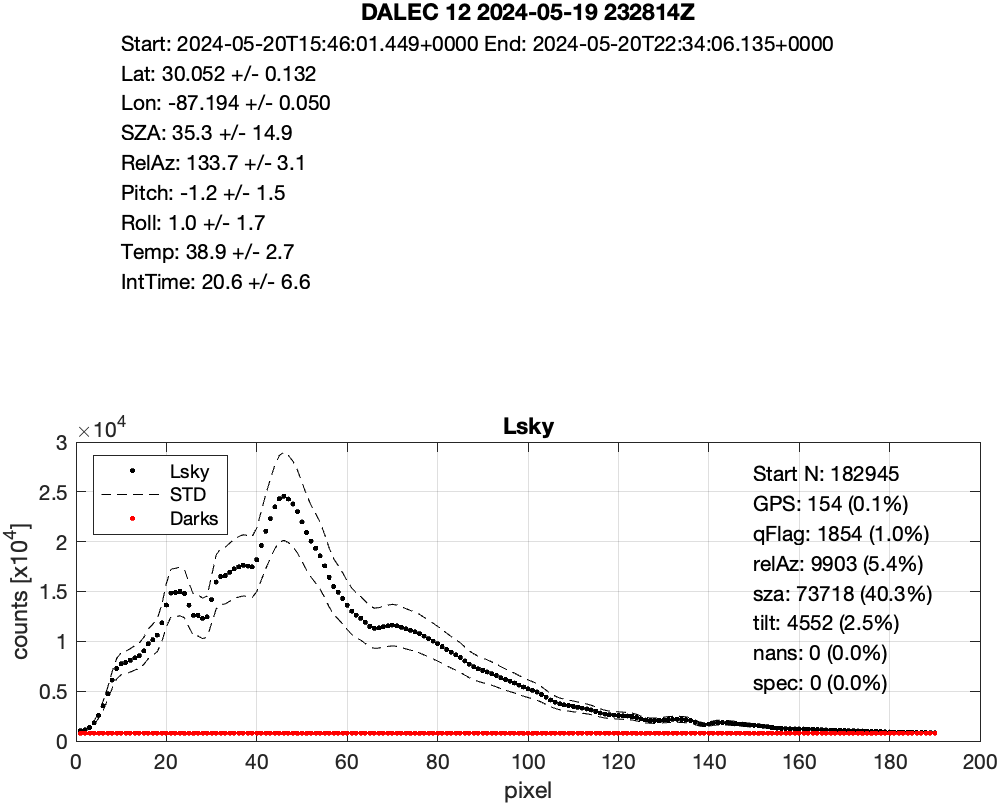

# DALEC
## dalec_L1A.m
Read raw dalec .TXT raw files into L1A arrays

* Screen for NaNs in GPS Lat/Lon
* Screen for QFlag "This flag for your current DALEC firmware version (v3.5-96-g130bc2f) relates
   to the GearPos movement. 0 = stationary and 1=moving during the spectrometer integration. This
   column will contain extra bits of info with the next firmware update and will let you know of the details when the time comes."
* Screen for relAz
* Screen for SZA
* Screen for tilt
* Screen for spectral outliers and NaNs

 Input:  Raw text files from DALEC acquisition software (duration unclear)

 Output: L1A matlab structures
           Plots of uncalibrated Ed, Lu, Lsky with QC stats

D. Aurin NASA/GSFC November 2024
* TO DO: Add a wrapper script that calls all of them sequentially.
<center></center>
<center></center>
<center></center>

 ## dalec_L1B.m
 Process L1A DALEC to L1B
 
 * Apply calibrations and dark offsets
 Calibration file usage:
```
    K1=d0*(V-DC)+d1
    K2=e0*(V-DC)+e1
    K3=f0*(V-DC)+f1
    Ed=a0*((V-DC)/(Inttime+DeltaT_Ed)/K1)/(Tempco_Ed*(Temp-Tref)+1)
    Lu=b0*((V-DC)/(Inttime+DeltaT_Lu)/K2)/(Tempco_Lu*(Temp-Tref)+1)
    Lsky=c0*((V-DC)/(Inttime+DeltaT_Lsky)/K3)/(Tempco_Lsky*(Temp-Tref)+1)
```
 * Interpolate to common timestamps and wavebands

 Inputs: L1A files from dalec_L1A.m, calibration file from IMO

 Output: L1B files matlab structures
        Combined plots of calibrated Ed, Lu, Lsky mean +/- std
        
D. Aurin NASA/GSFC November 2024
<center></center>


## dalec_L2.m
Process L1B DALEC to L2

* Add ancillary data from field log file       
You need to build an ancillary structure in a file with:  <--- Note!!
       
Required fields: datetime, lat, lon,

Strongly encouraged: station, wind, sst, sal, AOD, cloud, waves

This will be matched to your radiometry as described below
* Break into hourly file groups for output
* Run the spectral outlier filter
* Extract 300s ensembles
* Drop brightest 90% of Lt(780) for glitter
* Take the slice mean of the ensemble for Lt,Li,Es

* Calculate the Zhang et al. 2017 glint correction

This will require the database which can be downloaded here: <--- Note!!
           https://oceancolor.gsfc.nasa.gov/fileshare/dirk_aurin/
       It's ~2 GB and needs to be renamed and placed in ./dat/db.mat
* Calculate Lw and Rrs for the ensemble with uncertainty
 
* Calculate the NIR residual correction

Currently only implemented for flat offset   

* Screen for negative Rrs

   Inputs: L1B files from dalec_L1B.m
   Output: L2 files Hourly .mat files, L2 Hourly .sb files
           Combined plots of calibrated Es, Lt, Lw, Rrs ensembles mean +/-
           std with some metadata on QC

 D. Aurin, NASA/GSFC November 2024
 TO DO: Improve by switching between flat offset and SimSpec based on AVW
 <center></center>